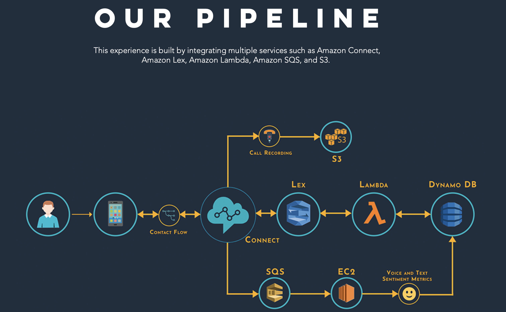
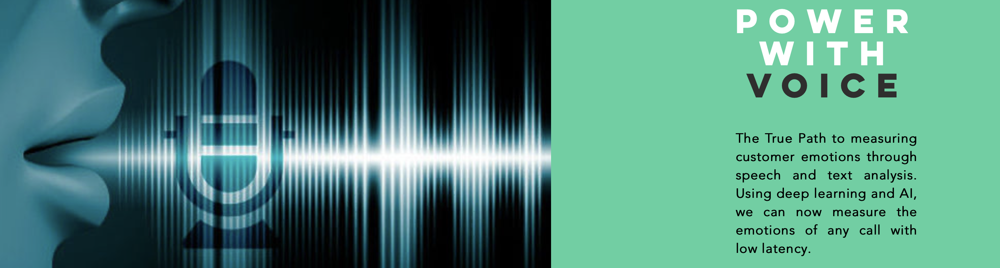

# Hey How Can We Help You? 
# AI for a Better Customer Support Experience

## MSBA FALL TRENDS 

***Website: https://ranjanvd.wixsite.com/mysite***

# Problems

| **01 / ERRORS IN MANUAL ENTRY**                              | 01 / ERRORS IN MANUAL ENTRY                                  | 03 / LACK OF FEEDBACK                                        |
| :----------------------------------------------------------- | ------------------------------------------------------------ | ------------------------------------------------------------ |
| Most calls to customer care centers involve logging the customer details like customerID, name and order details like product type. This is done manually by employees and is error-prone. This reduces the accuracy of entered details and can result in miscommunication as well as data quality issues. Asking customers to repeat information irritates them negatively impacting service quality. | A customer care agent's time is best used in dealing with intricacies of issues faced by customers, as they require real-time adaptation of responses based on customer's reactions. As any call to a customer care center involves details verification in the initial part of the call, an agent's time is wasted for these trivial tasks which can be done by machines. | Most customers do not fill out feedback forms or surveys. So organizations can't measure customer satisfaction. This makes it harder for them to evaluate the call handling capabilities of employees. The ability to appease customers is an important skill for call center employees to retain customers. |

# Our Solutions

|  |  |  |
| :----------------------------------------------------------: | :----------------------------------------------------------: | :----------------------------------------------------------: |
|                   **Advanced Automation**                    |                  **Speed and Consistency**                   |              **Voice based emotion detection**               |
| By only asking for a single identifier from the customer, the rest of the customer and order details can be auto-filled by querying the database. This prevents errors and repetitions. This can improve data quality and avoid faulty transactions thus saving correction costs. | Automating the process of basic details verification frees up a call-center agent's time to address a customer's actual concerns. So the agents can dedicate more time towards providing a better experience for customers and also be able to help more customers given the same time. Thus, reducing wait times for customer as well. | Customer feedback can be indirectly obtained by leveraging voice data to detect employee's emotions over a call. Pitch based attributes can be used as indicators of anger, calmness, etc. This helps in measuring an employee's ability to maintain a calm tone and pacify aggrieved customers. |

# Our Product

**Pipeline**

This experience is built by integrating multiple services such as Amazon Connect, Amazon Lex, Amazon Lambda, Amazon SQS, Amazon EC3 and S3. 

**Voice Emotions**

We beliven the true path to measuring customer emotions is through speech and text analysis. Using deep learning and AI, we can now measure the emotions of any call with low latency. Using Advanve Neural Network (CNN) we are able to derive emotions. 

**For additional details please refer to [Project Guide.pdf](https://github.umn.edu/DHULI010/msbafalltrends/blob/master/Project Guide.pdf)**

# Use Cases

| **FINANCE**                                                  | **TECH SUPPORT**                                             | **INSURANCE**                                                |
| ------------------------------------------------------------ | ------------------------------------------------------------ | ------------------------------------------------------------ |
| It is a scary moment when a customer realizes their credit card has fraudulent charges. Getting a quick answer and swift resolution provides urgent relief the customer desires. | AI can collect monotonous information such as model or order number while waiting for agents to get free. This ensures the customer is always engaged showcasing value for their time. | Filing a claim can be very stressful and can lead to negative conversations. AI can help managers better understand what agents say which can lead to more positive conversations. |

**..And many more**

# Team

|                        |                                                        |
| ---------------------- | ------------------------------------------------------ |
| Vijay Ranjan Dhulipala | https://www.linkedin.com/in/vijayranjandhulipala/      |
| Sai Akhil Kodali       | https://www.linkedin.com/in/saiakhil-kodali/           |
| Vijay K Raghupati      | https://www.linkedin.com/in/vijay-k-raghupathi/        |
| Samira Arondekar       | https://www.linkedin.com/in/samira-arondekar/          |
| Michael Thompson       | https://www.linkedin.com/in/michael-thompson-412571b2/ |
| Anisha Mula            | https://www.linkedin.com/in/anisha-mula/               |
|                        |                                                        |

